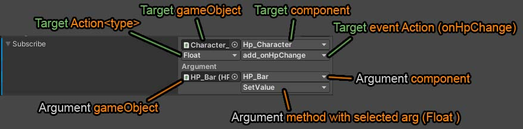
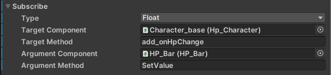

## How to use

1. Add 

```c#
[SerializeField] ActionEvent_Subscribe yourName;
```

2. Setup event.

> You can choose `event Action` types:
> - null
> - int
> - float
> - string
> - gameObject




How it stores parameters (view on DebugMode)\


